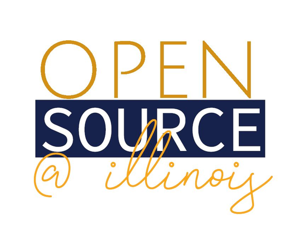

#  Open-Source @ Illinois ~ Constitution & By-Laws
## Article I: Name & Purpose

A: Name - Open-Source @ Illinois

B: Purpose: The RSO Open-Source @ Illinois serves to:
- Be a non-stressful environment to learn about Open Source technologies.
- Be the primary resource for people to learn about Open Source technologies.
- To foster meaningful connections with those who share similar interests and are involved in Open Source.
- To seek out and offer opportunities to get involved in Open Source.

As outlined in the University of Illinois Student Code, Open-Source @ Illinois will: 

- Not discriminate against a member or prospective member on the basis of race, color, religion, sex, national origin, ancestry, age, marital status, disability, unfavorable discharge from the military, or status as a disabled veteran or veteran of the Vietnam era, except as specifically exempted by law. Among the forms of invidious discrimination prohibited by University policy but not law is sexual orientation.

- Make available to any interested party who makes a request to the organization’s officers, if any, or authorized agent(s), its constitutions, bylaws, rules, and statements of purpose, and articles of incorporation, if such documents exist.

## Article II: Membership

A: Eligibility - Membership shall be restricted to currently enrolled students at the University of Illinois, Urbana-Champaign campus and their spouses/partners. Currently appointed faculty/staff and their spouses/partners also may be members. 
 
Membership shall include the following:
- Student Members, individuals who are currently enrolled students at UIUC.
- Members, individuals who fall in the criteria detailed in Article II.A but not in Article II.A.1.a.

B: Participation- Every board member is expected be a professional ambassador and to take a participatory role with Official Open-Source @ Illinois business including, but not limited to the following:

- Attendance 
- Promotional & Marketing Efforts (Tabling, Chalking, Marketing Input etc.)
- Workshops & Presentations 
- Selection Meetings (The reading of applications and selecting replacements)
- Conducting Consulting/Office hours 

C: Responsibility

- Members MUST maintain fairness and equality in allocation of RSO funds
- Members MUST make recommendations on items deemed for the good of ALL RSOs

D: Violation Procedures - To be an active and productive member of Open-Source @ Illinois is crucial to the success of the organization and as such; any violation or disruption to that productivity or not actively helping to promote Open-Source @ Illinois will result in the following:

1. Repeated occurrences of unproductive disruption during meetings and/or being disruptive to operations in official communication channels will lead to muting in the communication channels and/or temporary suspension of ability to attend or participate in Open-Source at Illinois socials, gatherings, and meetings. This will be considered by at least 80% of the officers.
2. Repeated suspension may lead to banishment from the RSO, at the unanimous discretion of the officers.

## Article III: Officers

A: Officers- The Officers of Open-Source @ Illinois shall be a President, Vice-President, Treasurer, Secretary, & Membership Chair

B: Eligibility - Officers must be the following:
- Students (Full or Part Time)
- Commit to a 1-year term, from Fall to Spring academic semesters
- Served at least 1 academic year as a student at the University of Illinois.
- Actively participated in the club for at least one full academic semester.

C: Election - The officers shall be elected by ballot at the last meeting of the spring semester by a majority of a vote cast for that office.

D: Term - The officers shall serve for five semesters and their term of office and will begin at the commencement of the fall semester.  

E: Vacancy- If a vacancy occurs in the office of the President, the Vice-President shall assume the office for the remainder of the term and vacancies of the Vice-President position shall be filled by special election.  

## Article IV: Duties of Officers

A: Chair - It shall be the duty of the President to:
- Preside over the meetings
- Create agenda for meetings
- Vote only in the case of a tie
- Represent the Organization (i.e. Participate in Quad Day, RSO Fairs and other events to represent the organization)
- Assist the “advisor” with planning and implementing Open-Source @ Illinois training
- Uphold and keep abreast on the Policies & Procedures of Open-Source @ Illinois
- Appoint committee chairpersons
- Prepare and submit the Open-Source @ Illinois End of the Year Report
- Set up and keep 1 to 1 meeting with the Advisor
- Perform such other duties as ordinarily pertaining to this organization

B: Vice-President - It shall be the duty of the Vice-President to:
- Preside in the absence of the President
- Serve as chairperson of appointed committees (research, marketing, program)
- Uphold and keep abreast on the Policies & Procedures of Open-Source @ Illinois
- Plan and execute programs & workshops implemented by Open-Source @ Illinois
- Set and keep 1 to 1 meeting with the Advisor
- Perform such other duties as ordinarily pertaining to this organization

C: Secretary - It shall be the duty of the Secretary to:
- Record the minutes of all meetings
- Keep a file of the Organization’s Records (including By Laws)
- Issue notices of meetings and conduct the general correspondence of the Organization
- Represent the Organization (i.e. Participate in Quad Day, RSO Fairs and other events to represent Open-Source @ Illinois)
- Uphold and keep abreast on the Policies & Procedures of Open-Source @ Illinois
- Collect and keep committee reports 
- Set and keep 1 to 1 meeting with the Advisor
- Perform such other duties as ordinarily pertaining to this organization

D: Treasurer - It shall be the duty of the Treasurer to:
- Keep an accurate budget for Open-Source @ Illinois
- Serve as the primary signatory on financial accounts 
- Collects Organization dues
- Pays Organization bills
- Maintains a financial history of the organization
- Provide advisor with summary of financial records at the end of the academic year	
  - Set and keep 1 to 1 meeting with the Advisor
  - Perform such other duties as ordinarily pertaining to this organization

E:  Membership Chair - It shall be the duty of the Membership Chair to:
- Promote Open-Source @ Illinois to increase knowledge and visibility
- Serve as the Social Media Administrator (Facebook, Instagram, Snapchat etc.)
- Use creative ways to spread the word about Open-Source @ Illinois
- Represent the Organization (i.e. Participate in Quad Day, RSO Fairs and other events to represent Open-Source @ Illinois)
- Uphold and keep abreast on the Policies & Procedures of Open-Source @ Illinois
- Set and keep 1 to 1 meeting with the Advisor
- Perform such other duties as ordinarily pertaining to this organization

## Article V: Open-Source @ Illinois Meetings

A: Meeting types. Open-Source @ Illinois will host two types of meetings:
- Open-Source @ Illinois General Meetings - Regular meetings held weekly during the regular school year
- Executive Meeting - Special meetings may be called by the President with the approval of the Executive Board (Ie. Selection Meetings, Financial Discussion, planning meetings for different outreach)
- Meetings shall be held no less than once every 1.5 academic weeks during the fall and spring semesters.

B: Quorum - A quorum shall consist of three officers of the Open-Source @ Illinois membership.

## Article VI: Advisor

A: Selection -  At least 80% of the Executive Board must vote in favor of a new advisor, and at least 60% of the Executive Board must vote in favor of leaving the current advisor. This will occur on a yearly basis. 

B: Duties - The responsibilities of the advisor shall be to:

- Maintain an awareness of the activities and programs sponsored by the Organization. 
- Meet on a regular basis with Open-Source @ Illinois Executive Board Members to discuss upcoming meetings, long range plans, goals, and problems of the club. 
- Attend regular meetings, executive board meetings as often as schedule allows. 
- Assist in the orientation of new officers. 
- Explain and clarify campus policy and procedures that apply to the RSO. 
- Provide direction in the area of parliamentary procedure, meeting facilitation, group-building, goal setting, and program planning. 
- Inform Open-Source @ Illinois members of those factors that constitute unacceptable behavior on the part of the club members, and the possible consequence of said behaviors.

## Article IX: Amendments

A: Selection - These bylaws may be amended by a two-thirds (2/3) majority vote of the board. 

B: Notice - All members shall receive advance notice of the proposed amendment at least five (5) days before the meeting.
